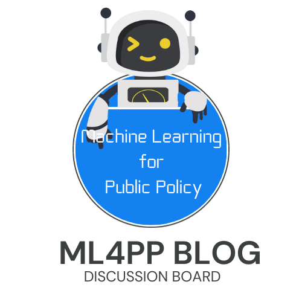

```{r setup, include=FALSE}
knitr::opts_chunk$set(echo = FALSE)
```

<center>
{width=40%}
</center>

As you go through the materials in the [Machine Learning for Public Policy](https://ml4publicpolicy.com) site, you may find yourself curious about what others learned from the tutorials. Or, you might run into trouble when trying to replicate the task locally. For those, or any other thoughts you may want to share, we'll open a blog post to which you can react by leaving a message. The course coordinators or your peers can reply to you. If you'd like to receive responses privately, leave your email in the comment!

